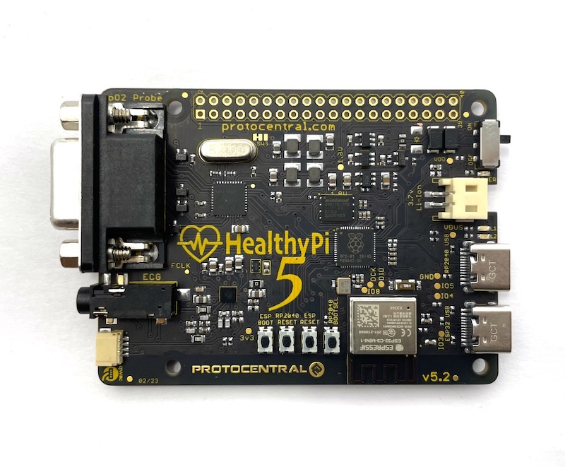

# HealthyPi 5 NEXT — Arduino Firmware

<p align="center">
  
</p>

<p align="center">
  <b>Buy a HealthyPi 5:</b>
  <a href="https://protocentral.com/product/healthypi-5-vital-signs-monitoring-hat-kit/">ProtoCentral Store</a>
  &nbsp;·&nbsp;
  <a href="https://www.mouser.com/c/?m=ProtoCentral&q=HealthyPi%205">Mouser</a>
  &nbsp;·&nbsp;
  <a href="https://www.crowdsupply.com/protocentral/healthypi-5">Crowd Supply</a>
</p>

> **v2.0.0 is a complete rewrite** — the production **NEXT** dual-core architecture,
> packaged as an Arduino library. The previous 2023 sketches are preserved on the
> [`v1-legacy`](https://github.com/Protocentral/protocentral_healthypi_5_firmware/tree/v1-legacy)
> tag. The ESP32-C3 (BLE / Wi-Fi) firmware has moved to
> [`healthybridge-esp32`](https://github.com/Protocentral/healthybridge-esp32).
> See [`CHANGELOG.md`](CHANGELOG.md).

Arduino-framework firmware for the [ProtoCentral HealthyPi 5](https://protocentral.com/product/healthypi-5-vital-signs-monitoring-hat-kit/)
biosignal monitoring board (RP2040 main MCU). It is the **maker- and
educator-friendly** member of the HealthyPi 5 NEXT firmware family: from
single-sensor sketches you can read top to bottom, up to a full dual-core
firmware that is byte-compatible with **OpenView 2** and the production NEXT
firmware.

HealthyPi 5 is an open-source development board for exploring biosignals —
electrocardiogram (ECG), respiration, photoplethysmography (PPG), oxygen
saturation (SpO₂), and body temperature.

> **This repository is the Arduino firmware for the RP2040 Main MCU.** Wireless
> (BLE / Wi-Fi) is not handled here — it is done by the companion **ESP32-C3
> "HealthyBridge"** co-processor firmware in
> [Protocentral/healthybridge-esp32](https://github.com/Protocentral/healthybridge-esp32),
> which speaks the same UART HealthyBridge wire protocol. See
> [Wireless](#wireless-ble--wi-fi).

> [!IMPORTANT]
> **You must also update the ESP32-C3 firmware.** The v2 NEXT firmware in this
> repository talks to the co-processor over the **HealthyBridge Lite** binary
> protocol, which the pre-v2 ESP32-C3 firmware does not speak. Flash the matching
> release of
> [`healthybridge-esp32`](https://github.com/Protocentral/healthybridge-esp32)
> onto the ESP32-C3 as well — otherwise the RP2040 side runs fine, but **BLE and
> Wi-Fi will not work**. Everything over USB (OpenView 2, the command plane) and
> SD recording is unaffected.

## Why "NEXT"?

The earlier HealthyPi 5 Arduino sketches were single-core and streamed on a
best-effort basis — under load they could drop samples, and several public
examples were mis-pinned for current board revisions. **NEXT** is the ground-up
rebuild of the HealthyPi 5 firmware around a **dual-core, lossless-by-design**
data path: one RP2040 core does nothing but acquire sensor samples, while the
other runs every consumer (DSP, USB/OpenView, SD, wireless bridge) as a
scheduled task. The two cores communicate through a single lock-free ring, which
makes guaranteed-lossless 128 SPS sampling a property the architecture *enforces*
rather than one you tune for.

This repository brings that **same NEXT architecture to the Arduino framework**
(the [`arduino-pico`](https://github.com/earlephilhower/arduino-pico) core), so
makers and educators get the robust production design in an Arduino IDE workflow —
while staying byte-compatible with the NEXT firmware and OpenView 2 so it
interoperates with the rest of the ecosystem.

## Hardware features

- **RP2040** dual-core ARM Cortex-M0+ Main MCU, 16 MB onboard flash
- **ESP32-C3** RISC-V co-processor with BLE and Wi-Fi (separate firmware)
- **MAX30001** analog front end — ECG and respiration
- **AFE4400** analog front end — PPG (SpO₂)
- **MAX30205** I²C body-temperature sensor
- **MicroSD** card slot for onboard recording
- On-board **Li-Ion** battery management with USB charging
- 40-pin Raspberry Pi **HAT** connector (also drives the Display Add-On Module)

Revisions **5.2 through 5.7 are electrically identical**, so one pin map serves
all of them — see [`docs/PIN_MAP.md`](docs/PIN_MAP.md).

## The firmware family

| Repo | MCU | Framework | Role |
|---|---|---|---|
| [`healthypi5_next_rp2040`](https://github.com/Protocentral/healthypi5_next_rp2040) | RP2040 | Pico SDK + FreeRTOS | production main MCU (lossless, dual-core) |
| [`healthybridge-esp32`](https://github.com/Protocentral/healthybridge-esp32) | ESP32-C3 | ESP-IDF + NimBLE | production wireless co-processor |
| **`healthypi5_next_arduino`** (this) | RP2040 (+ESP32-C3) | **Arduino** | teaching / maker reference, OpenView-compatible |

## What's in this repo

| Folder | What it is |
|---|---|
| [`libraries/HealthyPi5/`](libraries/HealthyPi5) | The runtime library: the canonical **`board.h`** pin map **and** the dual-core NEXT spine (acquisition, broker, OpenView, HealthyBridge, SD, watchdog). |
| [`examples/Tutorials/`](examples/Tutorials) | **11 standalone sketches** (01–11), one signal/idea at a time, for the Serial Plotter/Monitor, OpenView 2, wireless, and SD logging. Start here to learn the board. |
| [`examples/Applications/`](examples/Applications) | The full dual-core NEXT firmware (headless). |
| [`scripts/`](scripts) | `install-core.sh`, `build.sh`, `upload.sh` — one-command setup, compile, and flash (see [Command-line workflow](#command-line-workflow-scripts)). |
| [`extras/docs/`](extras/docs) | Pin map and the two-chip wireless model. See [Documentation](#documentation). |

## Getting started (Arduino IDE)

1. **Install the board core.** In *Boards Manager*, install
   **[`arduino-pico`](https://github.com/earlephilhower/arduino-pico)** (Earle
   Philhower). Select board **"Raspberry Pi Pico"**.
2. **Install the sensor libraries** (*Library Manager*):
   - **ProtoCentral MAX30001** — v2.0.0 or newer (ECG / BioZ / heart rate)
   - **ProtoCentral AFE4490 PPG and SpO2 boards library** — provides the AFE4400
     driver **and** the SpO₂ algorithm (the board's PPG AFE is an **AFE4400**, not
     a MAX3010x)
3. **Install the `HealthyPi5` library.** Copy [`libraries/HealthyPi5/`](libraries/HealthyPi5)
   into your Arduino libraries folder (e.g. `~/Documents/Arduino/libraries/`). It
   provides the canonical `board.h` every sketch uses.
4. **Open a sketch** from `examples/` — e.g.
   [`examples/Tutorials/01_ECG_Plotter`](examples/Tutorials/01_ECG_Plotter) — and
   click **Upload**.
   - For the **Applications** (`examples/Applications/…`), also set
     **Tools → os: "FreeRTOS SMP"** before uploading.
5. **View the output:** open **Tools → Serial Plotter** (or **Serial Monitor**)
   at **115200 baud** for the teaching sketches; use **OpenView 2** for the
   multi-channel binary stream.

> Prefer the command line? See [Command-line workflow](#command-line-workflow-scripts)
> at the end — it also flashes over the Raspberry Pi Debug Probe.

## The `HealthyPi5` library

`libraries/HealthyPi5/` plays two roles:

- **`board.h`** — the single source of truth for pins (rev 5.2–5.7). Every sketch
  includes it via the `HPI_PIN_*` macros, so no GPIO is ever hardcoded. The 9
  basic teaching sketches use **only** this.
- **The dual-core runtime** — the whole NEXT spine (core1 lossless acquisition
  into a lock-free ring; core0 broker + per-sink queues + OpenView + HealthyBridge
  + SD + telemetry + hardware watchdog). The Applications are thin sketches
  over it. Requires the arduino-pico **FreeRTOS-SMP** variant (`#include <FreeRTOS.h>`).

> **The library itself drives no display.** There is no LCD code in `src/`, and
> there is deliberately no graphics dependency in `library.properties` — the
> library owns both cores and every timing-critical path, and a display driver is
> neither. The in-library LVGL vitals screen is still held back pending hardware
> validation.
>
> You can still put vitals on a panel today:
> [`12_Display_Vitals`](examples/Tutorials/12_Display_Vitals) drives an **ILI9488**
> from the **sketch**, reading `HealthyPi5.vitals()` and `HealthyPi5.read()`
> through the ordinary public API. Swap in any graphics library you like — the
> core library neither knows nor cares.

## Tutorials (`examples/Tutorials/`)

Single-purpose, read-top-to-bottom sketches. **01–07** bring up one sensor each;
**08–12** are the more advanced ones (OpenView, your-own-DSP, wireless, SD, display).

| # | Sketch | Sensor | How to view it |
|---|---|---|---|
| 01 | `01_ECG_Plotter` | MAX30001 (ECG) | Serial **Plotter** @ 115200 |
| 02 | `02_Respiration_Plotter` | MAX30001 (BioZ) | Serial **Plotter** |
| 03 | `03_PPG_Plotter` | AFE4400 | Serial **Plotter** (IR + RED) |
| 04 | `04_SpO2` | AFE4400 | Serial **Monitor** (SpO₂ %, no-finger safe) |
| 05 | `05_HeartRate` | MAX30001 (RtoR) | Serial **Monitor** (bpm + R-R) |
| 06 | `06_Temperature` | MAX30205 (I²C) | Serial **Monitor** (°C, absent-safe) |
| 07 | `07_Vitals_Serial` | all three | Serial **Monitor** (combined line) |
| 08 | `08_OpenView_Stream` | all sensors | **OpenView 2** (29-byte binary frame) |
| 09 | `09_RawProcessing` | all sensors | your own DSP in `loop()` over the dual-core spine |
| 10 | `10_Wireless_Bridge` | all sensors | **ESP32-C3** → BLE / Wi-Fi (HealthyBridge) |
| 11 | `11_SD_Datalog` | all sensors | record raw waveforms to a microSD card (`/REC*.BIN`) |
| 12 | `12_Display_Vitals` | all sensors | **ILI9488 SPI display** — vitals tiles + sweeping ECG, drawn from the sketch |

See [`examples/Tutorials/README.md`](examples/Tutorials/README.md) for setup, pins,
and tips.

### Two visualisation paths

- **Arduino Serial Plotter / Monitor** — the right tool for single- or few-channel
  *numeric* output (sketches 01–07), at **115200 baud**.
- **OpenView 2** — for the full *multi-channel binary* stream (08 and the
  Applications). The Serial Plotter can't parse that packet; that's the one thing
  it doesn't do.

## Application firmware (`examples/Applications/`)

The complete headless firmware, a thin sketch over the `HealthyPi5` library.
Needs **os: FreeRTOS SMP**.

| Sketch | What it does |
|---|---|
| [`HealthyPi5_NEXT`](examples/Applications/HealthyPi5_NEXT) | The full headless firmware: lossless dual-core acquisition, OpenView 2 over USB-CDC, host command plane, config persistence, SD recording, I²C temp/battery, and the HealthyBridge link to the ESP32-C3. 1 Hz `HPI_INSTR` telemetry + hardware watchdog. |

## Wireless (BLE / Wi-Fi)

> [!IMPORTANT]
> **The ESP32-C3 firmware must be updated for this firmware to fully work.**
> The RP2040 ↔ ESP32-C3 link uses the **HealthyBridge Lite** binary framing
> (`0xAA55 | type | flags | len | seq | payload | crc16`), which is new in v2 and
> is not understood by the ESP32-C3 firmware that shipped with the v1 sketches.
> Until you flash the matching
> [`healthybridge-esp32`](https://github.com/Protocentral/healthybridge-esp32)
> release, the RP2040 will stream frames the co-processor silently ignores: no
> BLE, no Wi-Fi. (It never stalls acquisition — the bridge is a drop-newest sink,
> so USB/OpenView and SD keep working regardless.)
>
> Read the two counters in the 1 Hz `HPI_INSTR` telemetry line on UART0 to tell
> the two failure modes apart: a climbing `hbdrop=` means the ESP32-C3 is absent
> or not draining the UART at all, whereas `hbtx=` climbing with `hbdrop=0` means
> the link is up and the co-processor is reading frames — if BLE is still dead in
> that state, it is running mismatched firmware.

The RP2040 has **no radio** — it's a plain RP2040, not a Pico W. All wireless is
done by the on-board **ESP32-C3**, which runs its own firmware,
[`healthybridge-esp32`](https://github.com/Protocentral/healthybridge-esp32),
and owns both radios. The RP2040 streams to it over the **HealthyBridge** UART
link; BLE and Wi-Fi share the same RP2040-side code — the radio is chosen on the
ESP32. Learn the wire format in
[`10_Wireless_Bridge`](examples/Tutorials/10_Wireless_Bridge); see
[`docs/WIRELESS.md`](docs/WIRELESS.md) for the two-chip model and bring-up.

The ESP32-C3 firmware previously lived in an `esp32/` folder in this repository;
it moved to [`healthybridge-esp32`](https://github.com/Protocentral/healthybridge-esp32)
in v2.0.0, and the v1 sketch is preserved on the
[`v1-legacy`](https://github.com/Protocentral/protocentral_healthypi_5_firmware/tree/v1-legacy)
tag.

## Command-line workflow (`scripts/`)

For CI, batch builds, or flashing over the Raspberry Pi Debug Probe, the repo
ships three scripts (need [`arduino-cli`](https://arduino.github.io/arduino-cli/)):

| Script | Purpose |
|---|---|
| `./extras/scripts/install-core.sh` | Register + install the arduino-pico core and the ProtoCentral sensor libraries. Idempotent. |
| `./extras/scripts/build.sh <target>` | Compile one target (or `all` / `tutorials`) against the in-repo library. |
| `./extras/scripts/upload.sh <target>` | Build + flash. Default programmer is the **Raspberry Pi Debug Probe** (SWD); `--serial` falls back to USB/UF2, `--monitor` opens the UART console. |
| `./extras/scripts/display.sh` | One command for [`12_Display_Vitals`](examples/Tutorials/12_Display_Vitals): checks for **Arduino_GFX**, installs it if missing, then builds + flashes. Passes `--monitor` / `--serial` / `--port` straight through to `upload.sh`; `--build-only` compiles without flashing. |

```bash
./extras/scripts/install-core.sh          # one-time setup
./extras/scripts/upload.sh ecg --monitor  # teaching: ECG on the Serial Plotter/Monitor
./extras/scripts/upload.sh next           # HealthyPi5_NEXT (OpenView 2 + wireless + SD)
./extras/scripts/display.sh --monitor     # 12_Display_Vitals on an ILI9488 panel
```

**Targets:** `next` · `openview` · `raw` · `datalog` · `display` ·
`ecg` `resp` `ppg` `spo2` `hr` `temp` `vitals` `wireless` · `tutorials` (all
standalone tutorial sketches) · `all`.

`display` additionally needs the **"GFX Library for Arduino"** (Arduino_GFX),
which `install-core.sh` installs for you. It is *not* a dependency of the
HealthyPi 5 library — no other target requires it.

## Documentation

- [`extras/docs/PIN_MAP.md`](extras/docs/PIN_MAP.md) — authoritative pin map + what the old sketch got wrong.
- [`extras/docs/WIRELESS.md`](extras/docs/WIRELESS.md) — the RP2040 ↔ ESP32-C3 two-chip wireless model.

## License

MIT (first-party firmware). Third-party libraries retain their own licenses.
